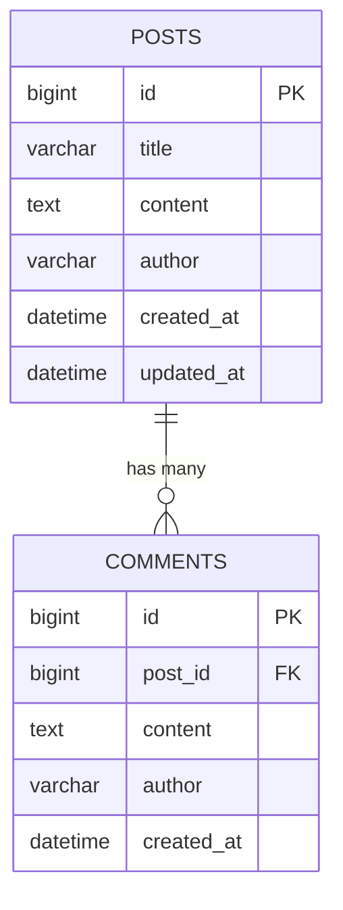

# DB 설계 도구 가이드

> PM이 알아야 할 실무 데이터베이스 설계 도구

작성일: 2025-10-17

---

## 🎯 요약

**실무에서 DB 설계 도구는 프로젝트 규모와 목적에 따라 달라집니다:**

- **공공기관**: ERWin, DA# (유료) + Word/HWP 문서화
- **중소기업**: dbdiagram.io (무료, 추천!)
- **SimpleBlog**: Markdown + DDL 코드 (간단해서 도구 불필요)

---

## 📊 실무 DB 설계 도구 (규모별)

### 1. 공공기관/대형 SI 프로젝트

**실제 설계 도구:**

#### ERWin (60%) - 전통적인 국내 공공/금융권 표준
```
✅ 국내 공공기관 대부분 사용
✅ 데이터 표준화 관리 기능
✅ Forward/Reverse Engineering (코드↔ERD 자동 변환)
✅ 대용량 DB 설계 지원
✅ 제안서 신뢰도 높음 (업계 표준 도구)
❌ 유료 (고가 - 수백만원)
❌ 학습 곡선 높음
```

**주요 기능:**
- 논리 ERD / 물리 ERD 분리 설계
- 데이터 표준 사전 관리
- 영향도 분석 (테이블 변경 시 영향 범위)
- DDL 자동 생성 (Oracle, MySQL, PostgreSQL 등)

---

#### DA# (30%) - 국산 도구
```
✅ 공공기관 국산 SW 우대 정책으로 선호
✅ 한글 지원 우수
✅ 전자정부 프레임워크 호환
✅ 국내 기업 기술 지원
❌ 유료
❌ ERWin보다 기능 제한적
```

**언제 사용?**
- 공공기관 국산 SW 의무 비율 충족 필요 시
- 한글 주석/설명이 많은 프로젝트
- 중앙부처, 지자체 프로젝트

---

#### PowerDesigner (10%) - SAP 제품
```
✅ 대기업 표준
✅ 다양한 DB 지원
✅ UML, BPMN 등 통합 모델링
❌ 유료
❌ 학습 곡선 높음
```

---

**제안서/납품 문서:**

**MS Word (.docx)** 또는 **한글 (.hwp)**

```
작업 흐름:
1. ERWin으로 ERD 설계
2. ERD 이미지 캡처 (PNG/JPG)
3. Word/한글 문서에 붙여넣기
4. 테이블 정의서는 표로 작성
5. PDF 변환 후 제출
```

**제안서 포함 내용:**
```
3.3 데이터베이스 설계 (30-50페이지)
  3.3.1 ERD (Entity Relationship Diagram)
        → 논리 ERD 1장
        → 물리 ERD 1장

  3.3.2 테이블 정의서
        → 테이블별 1페이지
        → 테이블명, 한글명, 설명

  3.3.3 컬럼 정의서
        → 컬럼명, 타입, 길이, NULL 허용, 기본값, 설명

  3.3.4 인덱스 설계
        → 성능 최적화 근거

  3.3.5 데이터 표준 준수
        → 전자정부 표준 용어 사용
```

---

### 2. 중소기업/스타트업

#### dbdiagram.io (40%) - 추천! ⭐

```
✅ 무료 (기본 기능)
✅ 웹 기반 - 설치 불필요
✅ 코드로 ERD 작성 (빠름!)
✅ 실시간 협업 가능
✅ PNG/PDF/SQL 내보내기
✅ 직관적 UI
✅ 버전 관리 가능 (Pro)
```

**예시 코드:**
```
Table posts {
  id bigint [pk, increment]
  title varchar(200) [not null]
  content text [not null]
  author varchar(100) [not null]
  created_at datetime [not null, default: `now()`]
  updated_at datetime [not null]
}

Table comments {
  id bigint [pk, increment]
  post_id bigint [ref: > posts.id]
  content text [not null]
  author varchar(100) [not null]
  created_at datetime [not null]
}
```

**장점:**
- 코드 기반이라 빠르게 작성
- Git으로 버전 관리 가능
- 팀원과 공유 쉬움
- 무료 버전도 충분히 사용 가능

**사용 방법:**
1. https://dbdiagram.io 접속
2. 코드로 테이블 정의 작성
3. 자동으로 ERD 생성됨
4. Export → PNG/PDF/SQL

---

#### draw.io (30%)

```
✅ 무료
✅ 다목적 다이어그램 도구
✅ VS Code 확장 있음
✅ 오프라인 사용 가능
❌ DB 전용 기능 부족
❌ DDL 자동 생성 안 됨
```

**언제 사용?**
- ERD뿐만 아니라 시스템 구성도, 플로차트도 그려야 할 때
- 이미 draw.io 사용 중인 팀

---

#### MySQL Workbench (20%)

```
✅ 무료
✅ MySQL 공식 도구
✅ ERD → DDL SQL 자동 생성
✅ Reverse Engineering (DB → ERD)
✅ DB 연결해서 실시간 확인
❌ MySQL 전용 (다른 DB 지원 안 함)
❌ UI가 다소 복잡
```

**장점:**
- MySQL 사용한다면 가장 확실한 선택
- DB 연결해서 실제 테이블 구조 확인 가능
- Forward/Reverse Engineering 지원

**사용 방법:**
1. MySQL Workbench 설치
2. Database → Reverse Engineer (기존 DB에서 ERD 생성)
3. 또는 직접 ERD 그리기
4. File → Export → Forward Engineer to SQL CREATE Script

---

#### Notion Database (10%)

```
✅ 테이블 명세 작성용으로 적합
✅ 협업 쉬움
✅ 댓글로 피드백
❌ ERD 그리기는 불편
❌ DDL 자동 생성 안 됨
```

**언제 사용?**
- 팀이 이미 Notion 사용 중
- 테이블 정의서만 작성 (ERD는 다른 도구)

---

**문서화:**

**Notion** 또는 **Markdown**

```
협업 중: Notion (댓글/피드백)
개발 중: Markdown + Git
제출용: Word 변환
```

---

### 3. 개발자 중심 팀

**실제 설계 도구:**

#### MySQL Workbench (50%)
- 위에서 설명한 내용과 동일

#### dbdiagram.io (30%)
- 위에서 설명한 내용과 동일

#### Mermaid (20%) - Markdown 안에 ERD 작성

````markdown

````

**장점:**
```
✅ Markdown 파일 안에 ERD 코드 작성
✅ GitHub에서 자동 렌더링
✅ 버전 관리 자동 (Git)
✅ 추가 도구 불필요
❌ 복잡한 ERD는 표현 제한적
```

---

**문서화:**

**Markdown + Git**

```markdown
docs/
├── db-schema.md      ← ERD + 테이블 정의서
├── ddl.sql           ← CREATE TABLE 문
└── migration/        ← DB 변경 이력
    ├── v1.0_initial.sql
    └── v1.1_add_comments.sql
```

---

## 🔄 일반적인 작업 흐름 (실무)

```
1단계: 설계 (ERD 도구 사용)
   ↓
   ERWin / dbdiagram.io / MySQL Workbench
   - 테이블, 컬럼, 관계 설계
   - 정규화 검토 (1NF, 2NF, 3NF)
   - 인덱스 설계

2단계: 리뷰 (팀 내부 검토)
   ↓
   - DBA 리뷰 (성능, 정규화)
   - 백엔드 개발자 피드백 (쿼리 효율)
   - PM 확인 (요구사항 반영 여부)
   - 성능 검토 (대용량 데이터 대응)

3단계: 문서화 (제안서용)
   ↓
   Word/한글 문서 작성:
   - ERD 이미지 삽입
   - 테이블 정의서 (표)
   - 컬럼 설명
   - 제약조건 (PK, FK, UNIQUE, INDEX)

4단계: DDL 생성 (개발용)
   ↓
   CREATE TABLE 문 작성:
   - ERD 도구에서 자동 생성
   - 또는 수동 작성
   - Git으로 버전 관리

5단계: 승인 및 배포
   ↓
   - 고객 승인 (Word/한글 문서)
   - DB 생성 (DDL 실행)
   - 마이그레이션 스크립트 관리
```

---

## 🎯 SimpleBlog 프로젝트 - 선택한 방식

### 현재: Markdown + MySQL DDL 코드 ✅

**이유:**
```
1. 학습 목적 - PM이 DDL 문법 이해 필요
2. 무료 - 추가 도구 설치 불필요
3. 버전 관리 - Git으로 DDL 변경 이력 추적
4. 간단한 구조 - 테이블 1개만 있어서 도구 불필요
```

**파일 구조:**
```
docs/02-실전프로젝트/deliverables/step2-database/
├── 02-DB설계서.md        ← ERD(텍스트) + 테이블 정의
└── DB설계-도구-가이드.md  ← 이 파일
```

---

### 확장 시 권장:

**테이블 3개 이상:**
```
→ dbdiagram.io 사용 (무료, 직관적)
→ 코드로 빠르게 작성
→ PNG 내보내기로 문서에 삽입
```

**대규모 프로젝트:**
```
→ MySQL Workbench (무료)
→ ERWin (유료, 공공기관)
→ Forward/Reverse Engineering 필요
```

---

## 📊 도구별 추천 상황

| 상황 | 추천 도구 | 이유 |
|------|-----------|------|
| 학습/포트폴리오 | Markdown + DDL | 간단, 무료, Git 연동 |
| 스타트업 협업 | dbdiagram.io | 무료, 협업, 직관적 |
| 중소 프로젝트 | MySQL Workbench | 무료, 공식 도구, DDL 자동 생성 |
| 공공기관 제안 | ERWin → Word | 업계 표준, 고객 신뢰 |
| 대기업 SI | PowerDesigner | 대용량 지원, 표준화 |
| 빠른 프로토타입 | dbdiagram.io | 코드 기반, 빠름 |
| MySQL 전용 | MySQL Workbench | 공식 도구, 안정성 |

---

## ⚡ 실무 Tip

### 1. ERD 도구는 나중에 배워도 됨

```
처음: Markdown + DDL로 충분
나중: 프로젝트 규모 커지면 도구 도입

학습 우선순위:
1위: DDL 문법 이해 (CREATE TABLE)
2위: 정규화 개념 이해
3위: ERD 도구 사용법
```

---

### 2. 제안서용 ERD는 "보기 좋게"

```
❌ 기술적으로 완벽하지만 복잡함
   → 공무원이 이해 못 함

✅ 핵심만 보여주고 깔끔하게
   → 테이블 3-5개만 강조
   → 관계는 주요한 것만
   → 컬러 활용 (주요 테이블 강조)
```

**제안서 ERD 작성 요령:**
- 논리 ERD: 업무 중심 (고객이 이해하기 쉽게)
- 물리 ERD: 기술 중심 (개발자가 구현하기 쉽게)
- 복잡한 ERD는 영역별로 분리해서 여러 장

---

### 3. DDL 파일 버전 관리 필수

**버전별 SQL 파일 관리:**
```sql
-- v1.0_initial_schema.sql
CREATE TABLE posts (
  id BIGINT AUTO_INCREMENT PRIMARY KEY,
  title VARCHAR(200) NOT NULL,
  content TEXT NOT NULL,
  author VARCHAR(100) NOT NULL,
  created_at DATETIME NOT NULL DEFAULT CURRENT_TIMESTAMP,
  updated_at DATETIME NOT NULL DEFAULT CURRENT_TIMESTAMP
             ON UPDATE CURRENT_TIMESTAMP
);

-- v1.1_add_view_count.sql
ALTER TABLE posts ADD COLUMN view_count INT DEFAULT 0;

-- v1.2_add_comments_table.sql
CREATE TABLE comments (
  id BIGINT AUTO_INCREMENT PRIMARY KEY,
  post_id BIGINT NOT NULL,
  content TEXT NOT NULL,
  author VARCHAR(100) NOT NULL,
  created_at DATETIME NOT NULL DEFAULT CURRENT_TIMESTAMP,
  FOREIGN KEY (post_id) REFERENCES posts(id) ON DELETE CASCADE
);
```

**Git으로 관리:**
```bash
git add db/migration/v1.1_add_view_count.sql
git commit -m "feat(db): 조회수 컬럼 추가"
```

---

### 4. 공공기관 제안서 포함 내용

```
3.3 데이터베이스 설계 (제안서 섹션)

  3.3.1 ERD (Entity Relationship Diagram)
        → 논리 ERD 1장 (업무 관점)
        → 물리 ERD 1장 (기술 관점)

  3.3.2 테이블 정의서
        → 테이블별 1페이지

        | 테이블명 | 한글명 | 설명 |
        |----------|--------|------|
        | posts    | 게시글 | 블로그 게시글 정보 |

  3.3.3 컬럼 정의서

        | 컬럼명 | 타입 | 길이 | NULL | 기본값 | 설명 |
        |--------|------|------|------|--------|------|
        | id | BIGINT | - | N | AUTO_INCREMENT | PK |
        | title | VARCHAR | 200 | N | - | 제목 |

  3.3.4 인덱스 설계
        → 성능 최적화 근거

        | 인덱스명 | 대상 컬럼 | 타입 | 사유 |
        |----------|----------|------|------|
        | idx_created_at | created_at | INDEX | 최신순 정렬 |

  3.3.5 데이터 표준 준수
        → 전자정부 표준 용어 사용
        → 명명 규칙 (snake_case)
```

---

### 5. ERD 설명 스크립트 (PT용)

**제안 발표 시 ERD 설명 예시:**

> "SimpleBlog 시스템의 데이터베이스는 **정규화 3단계**를 준수하여 설계했습니다.
>
> 핵심 테이블은 **posts 테이블 1개**로 구성되며, 게시글 관리에 필요한 **6개 컬럼**을 포함합니다.
>
> **id 컬럼**은 BIGINT 타입의 기본키로, 최대 **922경 개**의 게시글을 지원합니다.
>
> **created_at 컬럼**에는 **인덱스**를 적용하여, 최신순 조회 시 성능을 최적화했습니다.
>
> 전자정부 표준 프레임워크의 **명명 규칙**을 준수하여, 유지보수성을 확보했습니다."

---

## 📚 도구별 공식 문서

### 무료 도구
- **dbdiagram.io**: https://dbdiagram.io/
- **MySQL Workbench**: https://www.mysql.com/products/workbench/
- **draw.io**: https://www.drawio.com/
- **Mermaid**: https://mermaid.js.org/

### 유료 도구
- **ERWin**: https://www.erwin.com/
- **DA#**: http://www.ateam.co.kr/
- **PowerDesigner**: https://www.sap.com/products/technology-platform/powerdesigner.html

### 학습 자료
- **DB 정규화**: https://en.wikipedia.org/wiki/Database_normalization
- **MySQL 공식 문서**: https://dev.mysql.com/doc/

---

## ✅ 결론

**SimpleBlog 프로젝트:**
- ✅ Markdown + DDL 방식으로 충분
- 테이블 1개라서 별도 ERD 도구 불필요
- Git으로 버전 관리

**실무 프로젝트:**
- 중소 프로젝트: dbdiagram.io (무료, 추천!)
- 공공기관: ERWin (유료, 업계 표준)
- MySQL 전용: MySQL Workbench (무료, 공식 도구)

**핵심 원칙:**
- 도구보다 **정규화**와 **성능 설계**가 더 중요
- ERD는 **의사소통 도구** (팀원과 고객이 이해하기 쉽게)
- DDL은 반드시 **Git으로 버전 관리**
